# 2.MicroPython使用教程文档.md

## 1、下载前准备

首先确定电脑是否安装ch34x驱动，将电路板通过数据线连接到电脑上，打开设备管理器
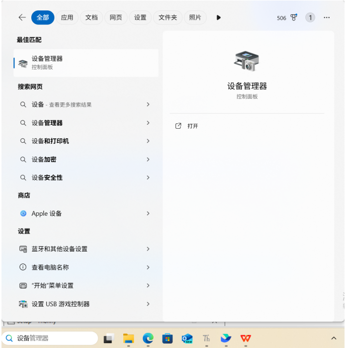

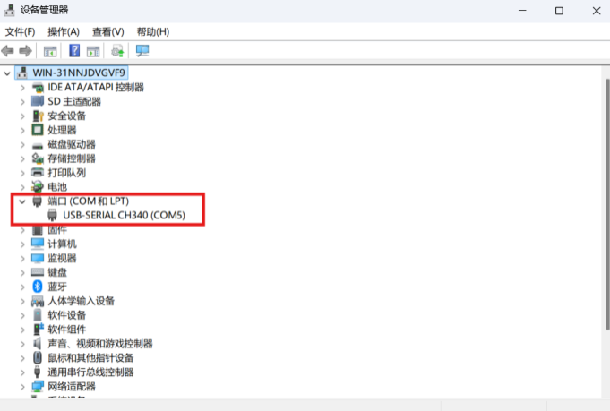

有端口下的USN-SERIAL CH340代表已经安装驱动，（COM口是电脑自定义的，不一定相同）没有的话双击\教程文档\搭建环境\CH341SER.EXE

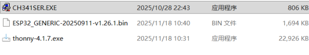

点击安装

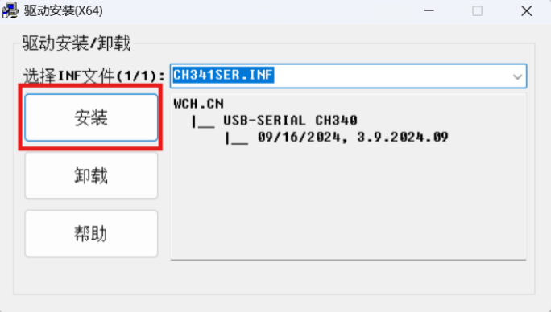

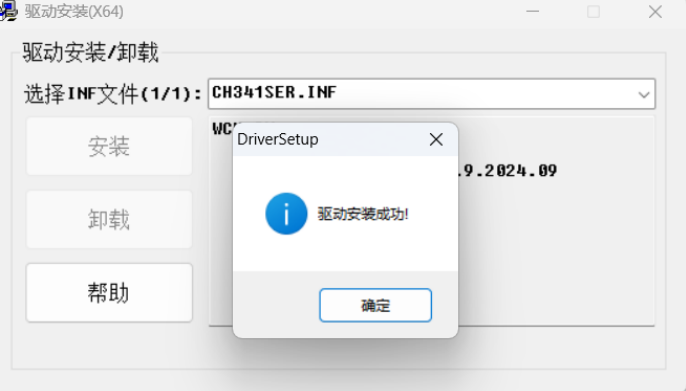

## 2、下载Thonny

双击thonny-4.1.7.exe应用程序

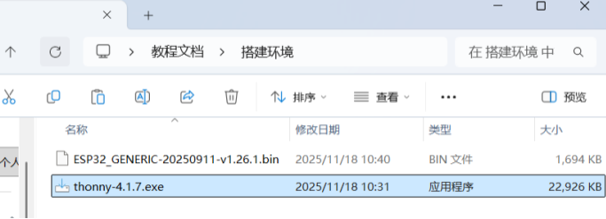

如果你不熟系电脑软件的安装，可以一直单击 Next 直至安装完成。

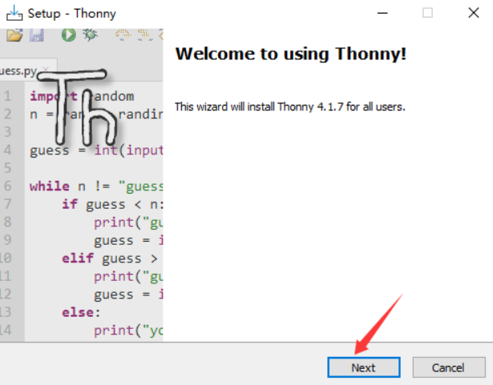

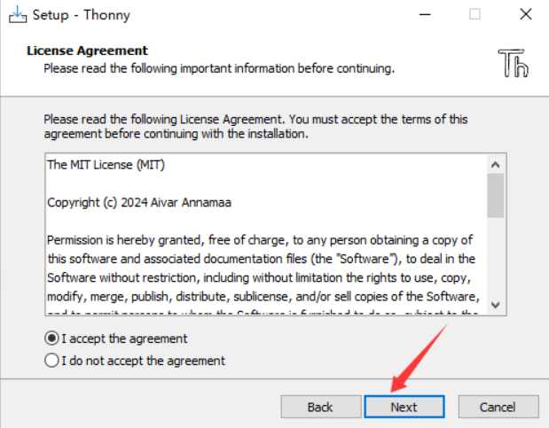

（4）Thonny软件的安装路径。默认此安装路径继续下一步，单击 Next 。如果您想选择一个不同的文件夹，请单击 Browse… 进行修改。

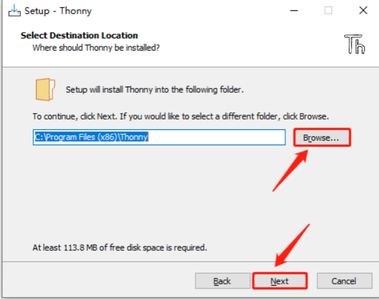

程序将在下面的开始菜单文件夹中创建程序的快捷方式。默认此文件夹继续下一步，单击 Next 。如果您想选择一个不同的文件夹，请单击 Browse… 。

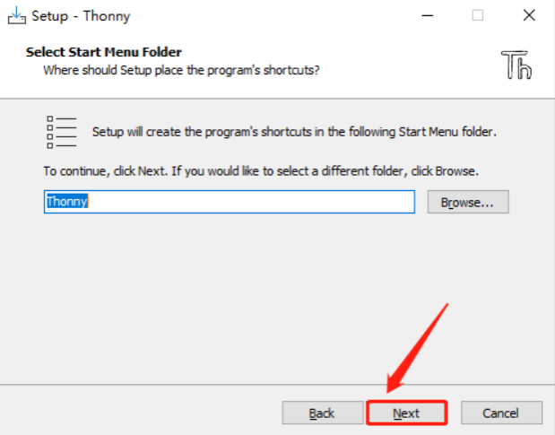

选中 Creak desktop icon ，在桌面生成快捷方式。

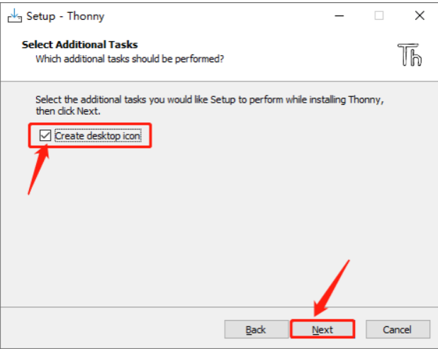

单击 Install 安装软件。等待安装成功。

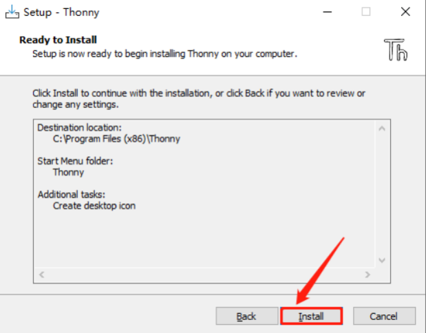

安装完成，单击 Finish 结束安装。

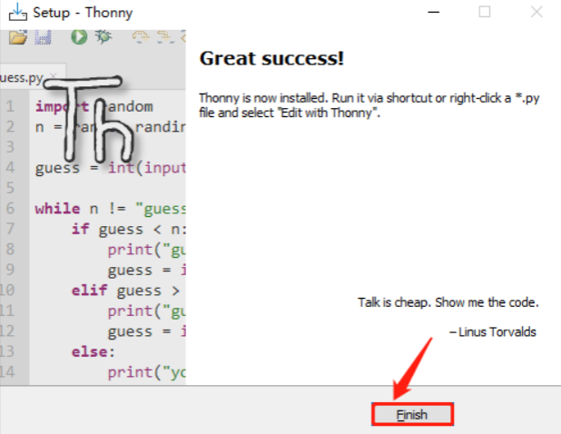

## 3、Thonny软件基本配置与介绍

### 3.1 Thonny软件基本配置

（1）双击桌面的Thonny软件图标

出现语言选择和初始设置界面。

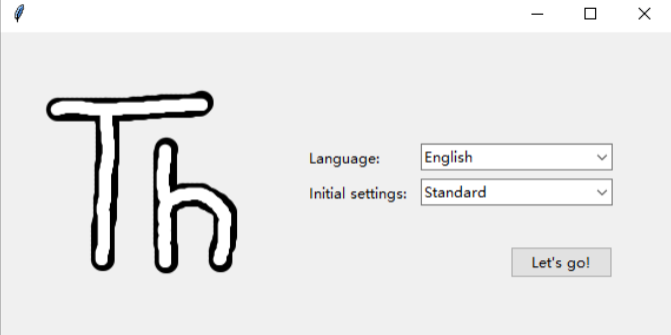

Language 选择 简体中文 。然后单击 Let’s go! 结束设置。

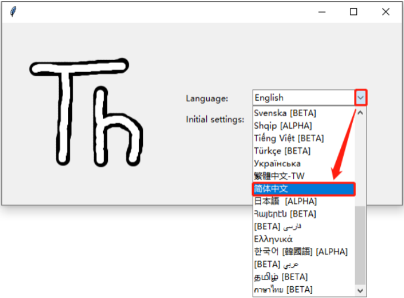

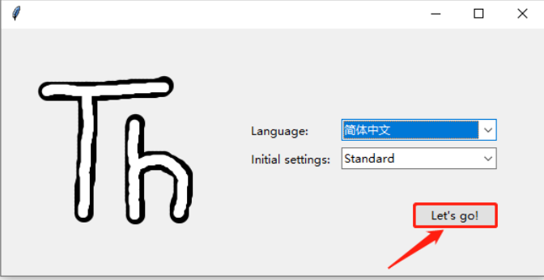

（2）单击 视图 ，勾选 Shell 和 文件

### 3.2 Thonny软件的介绍

界面介绍

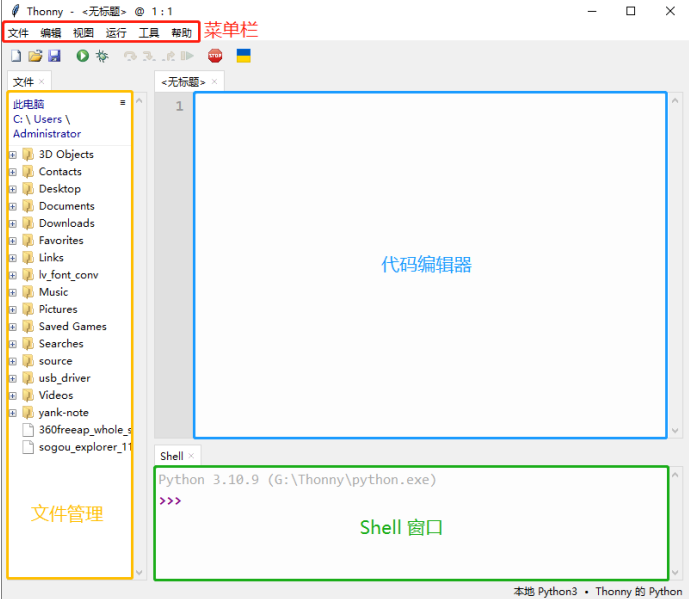

## 4、烧录固件

要在ESP32主板上运行Python程序，我们需要先将固件烧入到ESP32主板。

**烧录Micropython固件**

（1）将ESP32主板通过USB线连接到计算机。

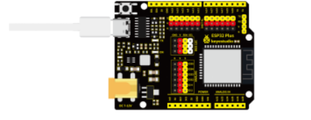

（2）打开Thonny，点击 运行 ，选择 配置解释器。

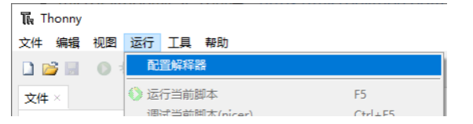

在解释器页面，按下图所示选择（COM号以你电脑的端口为准），然后单击安装或更新MicroPython（esptool）。

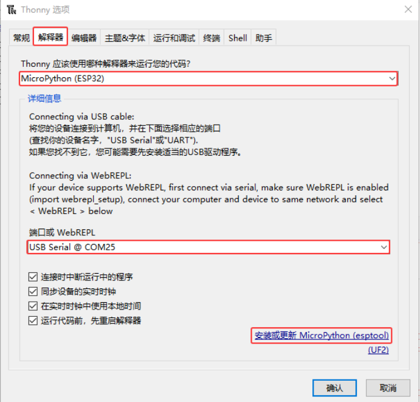

按下图所示选择，打开固件存放的路径，选中 esp32-20230426-v1.20.0.bin 。

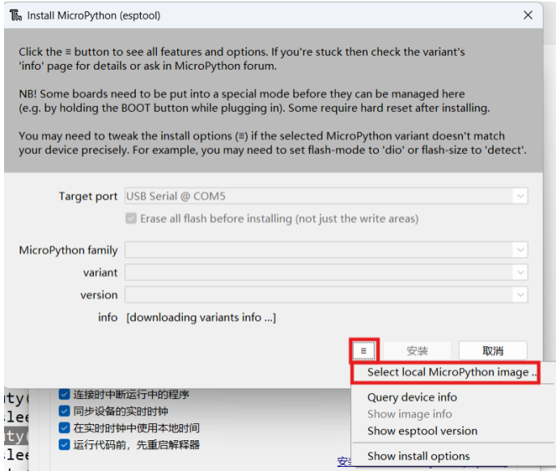

固件在..\教程文档\搭建环境下：

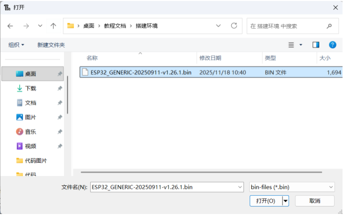

打开bin文件后点击安装并等待安装完成

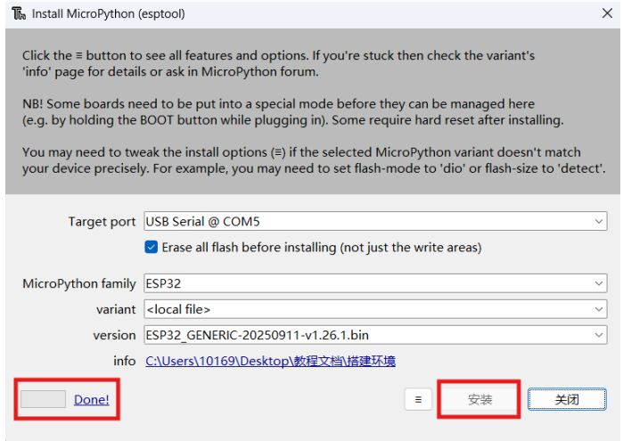

安装完成，单击 关闭 。

单击 确认 。

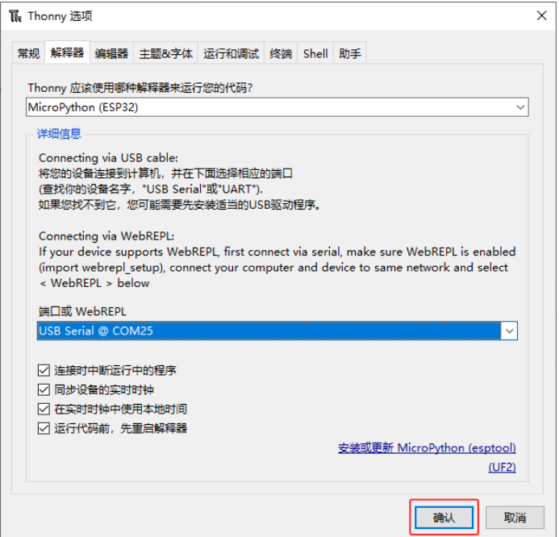

（5）点击**停止/重启后端进程**按钮。

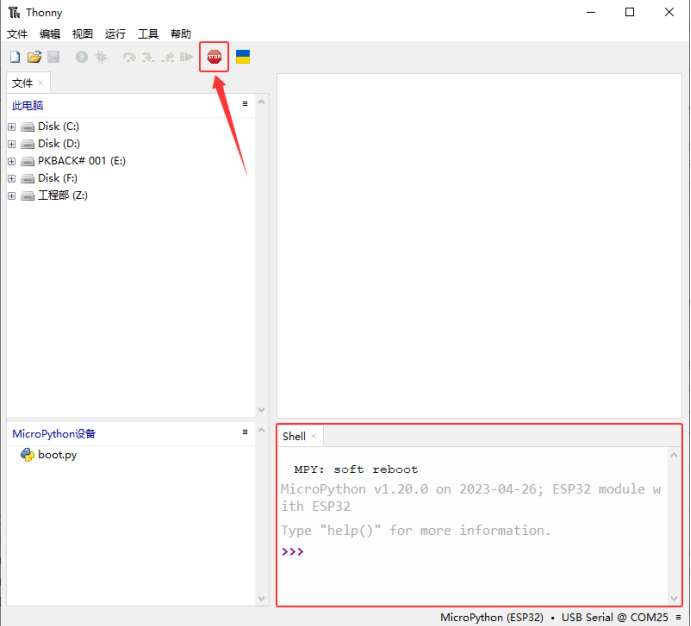

现在，一切准备工作都已就绪。

**测试Shell命令**

在 **Shell** 窗口中输入print('hello world')，然后按下**Enter**键。

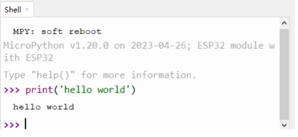