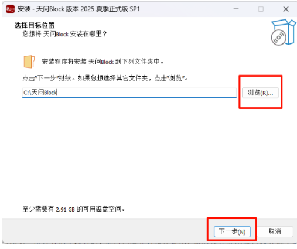
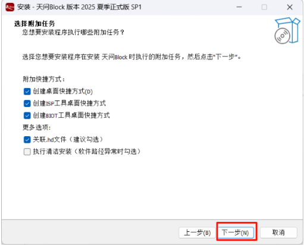
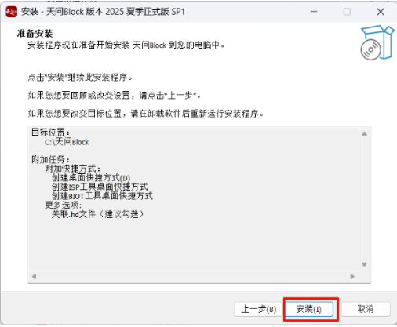
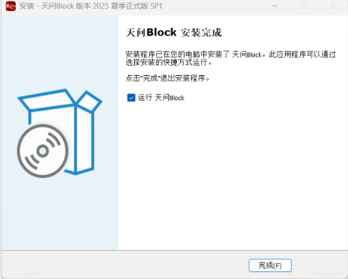
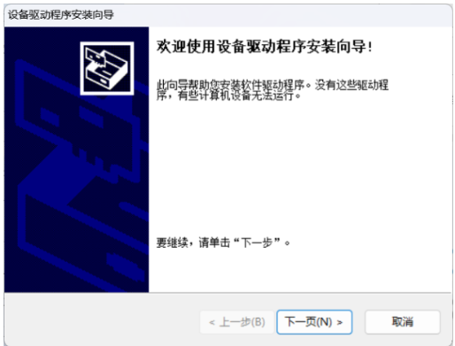
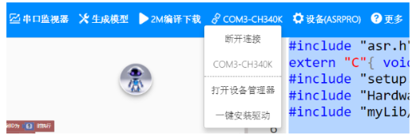

# 3.离线语音模块软件使用教程.md

## 1、软件安装

双击安装包

选择安装位置，然后点击下一步

点击下一步

点击安装，等待安装完成

## 2、驱动安装

安装完成后会启动驱动的安装，点击下一页，等待安装完成

## 3、软件操作步骤

### 第1步：启动与选择编程模式

首次打开软件，可跟随初始指引快速了解界面。

在编程区顶部，根据您的熟练程度，选择适合的编程模式。

### 第2步：项目设置与生成语音模型

设置云保存：点击工具栏左侧第三个图标（“云上传保存”），将项目保存至云端以防丢失

生成语音模型：完成程序编写后，点击 【生成模型】 按钮。系统会将您设定的指令词转换为可识别的语音模型。

频率限制提醒：此功能每3分钟仅能使用一次，请确认指令词无误后再操作。

### 第3步：编译与下载程序

检查连接：确保ASRPRO模块已通过Type-C线稳定连接至电脑。

选择端口：在软件中点击“串口”按钮，选择正确的COM口（可在电脑设备管理器中查看确认）。

编译下载：点击 【2M编译下载】 按钮，软件将自动编译并烧录程序至模块。

完成等待：等待进度条走完，直至显示“下载成功”提示。

**测试与验证**

程序下载成功后，系统即可独立运行。请对模块说出您已设定的语音指令，测试识别与控制功能是否正常执行

**常见问题解答**

无法识别串口：请检查Type-C线是否完好，或尝试更换电脑USB端口。一般情况下，ASRPRO模块无需额外安装驱动。

语音模型生成失败：请确保网络通畅，并确认是否在3分钟内重复点击了生成按钮。

设备无响应：请确认程序逻辑正确，并尝试重新插拔模块后进行再次下载。
